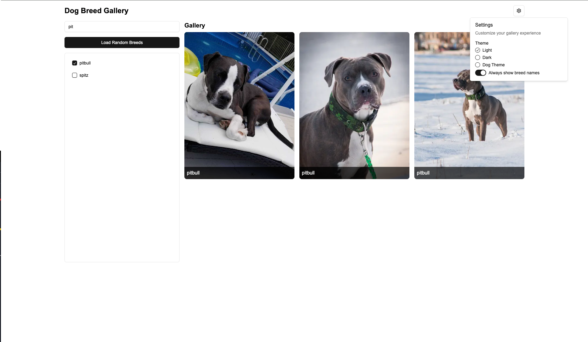

# Fetch Dog Breed Gallery

## Overview
This project utilizes the [Dog API](https://thedogapi.com/) to display a gallery of dog breed images. The user can select one or more dog breeds, and images of the selected breeds will be displayed in the gallery. The project also includes additional features like search functionality, theme switching (light, dark, and dog-themed), and the ability to randomly select breeds. It is built using React, TypeScript, Next.js, and shadcn/ui (UI tool to build custom components per project)

## Features
- **Breed Selection**: Users can select one or multiple dog breeds, and the gallery will display images of the selected breeds.
- **Search Functionality**: A search input is provided to filter the list of dog breeds.
- **Random Breed Selection**: A button to load three random dog breeds.
- **Theme Support**: Toggle between light, dark, and a custom "dog theme."
- **Responsive Design**: The layout is fully responsive and adjusts for different screen sizes.
- **Lazy Loading**: Images are lazy-loaded to optimize performance.

## Screenshots


## Live Demo
You can view a live demo of the Dog Breed Gallery [here](https://balashukla.com/blog/fetch-frontend-demo).

## Getting Started
Follow these to run the project locally on your machine.

### Prerequisites
- **Node.js**: You need to have [Node.js](https://nodejs.org/) installed on your system.
- **Git**: Ensure you have Git installed on your system to clone the repository.

### Installation

1. **Clone the repository**:
   ```bash
   git clone https://github.com/B-a-1-a/fetch-dog-breed-gallery.git
   ```

2. **Navigate to the project directory**:
   ```bash
   cd fetch-dog-breed-gallery
   ```

3. **Install dependencies**:
   Run the following command to install the project dependencies:
   ```bash
   npm install
   ```

4. **Run the development server**:
   After the dependencies have been installed, start the Next.js development server:
   ```bash
   npm run dev
   ```

5. **Open the project in your browser**:
   Once the server is running, open [http://localhost:3000](http://localhost:3000) in your browser to view the application. (If it is not in 3000 check your terminal as to what Next.js is using)

## Project Structure
```
├── app
│   ├── page.tsx      # Rendering of the main site
│   └── globals.css   # Global styles and theming (CSS)
├── components
│   └── [...].tsx     # Reusable shadcn UI components like Input, Button, etc.
├── next.config.mjs   # Next.js configuration
└── package.json      # Project dependencies and scripts
```
other files omitted for simplicity

## Extra Features
- **Search Breeds**: A search bar allows users to search for a specific breed from the breed list.
- **Random Breed Loading**: A "Load Random Breeds" button allows users to automatically select three random breeds and see their images in the gallery.
- **Theme Switcher**: A settings menu allows users to switch between light, dark, and dog themes.
- **Responsive Design**: The UI is optimized for mobile, tablet, and desktop views.

## Technologies Used
- **Next.js**: For building the React-based front-end application.
- **TypeScript**: Type safety and enhanced developer experience.
- **Tailwind CSS**: For styling and responsive design.
- **shadcn**: Open Source framework for reusable UI components.
- **Dog API**: To fetch the list of dog breeds and breed images.